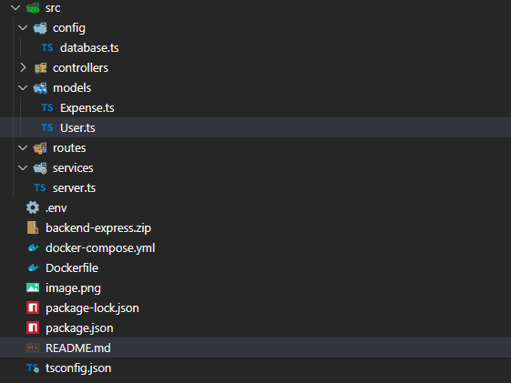

# 2️⃣ Arquitectura del Proyecto

## 📂 backend-app/ (Carpeta raíz del backend)

### Diagrama Relacional

📌 Diagrama Relacional
Voy a generar la imagen del diagrama con estos modelos:

1️⃣ users

- id (PK)
- name
- email (único)
- password
- createdAt
- updatedAt

2️⃣ categories

- id (PK)
- name
- createdAt
- updatedAt

3️⃣ expenses

- id (PK)
- name
- amount
- date
- userId (FK → users.id)
- categoryId (FK → categories.id)
- createdAt
- updatedAt

### Enpoints

Vamos a definir los siguientes endpoints básicos para gestionar los gastos:

📌 Usuarios (Users)
POST /users → Crear un usuario

GET /users/:id → Obtener un usuario por ID

GET /users → Obtener todos los usuarios

📌 Gastos (Expenses)
POST /expenses → Crear un gasto

GET /expenses/:id → Obtener un gasto por ID

GET /expenses?userId=X → Obtener todos los gastos de un usuario

PUT /expenses/:id → Actualizar un gasto

DELETE /expenses/:id → Eliminar un gasto

📌 Categorías (Categories)
POST /categories → Crear una categoría

GET /categories → Obtener todas las categorías

GET /categories/:id → Obtener una categoría por ID
